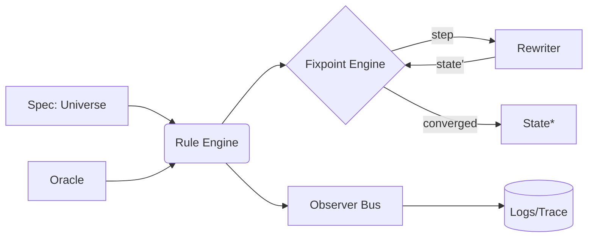

# 地球 Online 体验实验室 · Earth Online Experience Lab

> 把 Compute‑God 打造成一座“地球 Online”体验实验室：在这片交互式宇宙中重构概念、模拟策略、共创未来的运行手册。

<p align="center">
  
</p>

<p align="center">
  <a href="#愿景">愿景</a> •
  <a href="#实验分区">实验分区</a> •
  <a href="#快速沉浸">快速沉浸</a> •
  <a href="#探索者工具箱">探索者工具箱</a> •
  <a href="#实地笔记">实地笔记</a> •
  <a href="#共创计划">共创计划</a>
</p>

---

## 愿景

地球 Online 体验实验室把原本抽象的 meta‑computation 引擎重构为面向探索者的沉浸式空间：

* 🌍 **多维宇宙剧场**：以 `Universe = state + rules + observers` 的结构搭建“场景”，在概念、生态与社会模型之间切换。
* 🛰️ **自进化推演机**：通过不动点求解与重写系统迭代模拟策略，观察剧本如何在不同参量下收敛或分岔。
* 🧬 **概念器官库**：把 Rule/Oracle/Observer 组织成可组合的“器官模块”，支撑跨领域实验。
* 🔭 **可观测地层**：事件流、日志、追踪三位一体，让实验过程像地质断层一样一目了然。
* 🪐 **导览神谕**：`guidance_desk()` 成为探索者的入口，根据主题推荐宇宙、对偶与玩法。

> 使命：帮助地球玩家在有限时间里快速形成“看得更多，想得更深”的认知闭环。

---

## 实验分区

| 分区 | 描述 | 入口 |
| --- | --- | --- |
| **核心引擎** | `compute_god.core` 提供宇宙构建、规则编排与不动点驱动。 | `core.universe.God` |
| **叙事宇宙带** | 收录如 `everything_demonstration`、`earth_rescue` 等主题宇宙，模拟社会与科幻场景。 | `guidance_desk().catalog()` |
| **研究实验室** | `drug_lab`, `anti_quantum`, `complex_dynamics` 等模块，用于物理/药物/数学实验原型。 | `compute_god.drug_lab` |
| **生活共创区** | `love_wishing_machine`, `miyu_tiantian`, `marketing` 等模块，把日常体验建模为可运行脚本。 | `compute_god.miyu_tiantian` |
| **边界考古所** | `meta_spacetime`, `threshold`, `existence` 等探索宇宙边界与存在性的问题。 | `compute_god.meta_spacetime` |

每个分区都是可嵌套的宇宙，透过观察者与神谕共享上下文，构成「地球 Online」的协同生态。

---

## 快速沉浸

体验实验室的最快方式是把一个“剧场宇宙”装载进你的运行时：

```ts
// TypeScript
import { God, rule, fixpoint } from "compute-god";

const lab = God.universe({
  state: { term: "(Y f)" },
  rules: [
    rule("beta-reduce", ({ term }) => ({ term: beta(term) }), {
      until: ({ term }) => isValue(term) || steps() > 256,
    }),
  ],
});

const result = await fixpoint(lab, {
  metric: (prev, next) => editDistance(prev.term, next.term),
  epsilon: 0,
  maxEpoch: 64,
});

console.log(result.state.term);
```

```python
# Python
from compute_god import God, rule, fixpoint

lab = God.universe(
    state={"term": "(Y f)"},
    rules=[
        rule("beta-reduce", lambda s: {"term": beta(s["term"])},
             until=lambda s: is_value(s["term"]) or steps() > 256)
    ]
)

result = fixpoint(lab, metric=lambda a, b: edit_distance(a["term"], b["term"]), epsilon=0, max_epoch=64)
print(result.state["term"])
```

> 这些示例展示了地球 Online 核心——自解释的重写宇宙——如何迭代至稳定状态。

---

## 探索者工具箱

### 安装运行器

**Node.js (TypeScript/JavaScript)**

```bash
pnpm add compute-god
# or
npm i compute-god
```

**Python (via [uv](https://github.com/astral-sh/uv))**

```bash
uv pip install compute-god
```

> 两种运行器概念等价；`uv` 提供极速的 Python 依赖管理体验，同时保持对 PyPI 的兼容。

### 交互式导览台

安装后可使用 `compute-god` 命令行工具快速浏览宇宙分区：

```bash
$ compute-god stations
core
  - God
  - Universe
  - FixpointEngine

$ compute-god station core --format json
{
  "description": "内核宇宙的构造器与执行器。",
  "entries": [
    "God",
    "Universe",
    "rule",
    "fixpoint"
  ]
}
```

> CLI 输出与 `guidance_desk()` 同步，可用于文档生成、脚本拼装或纯粹的灵感探索。

### 核心概念速览

* **Universe（宇宙）**：把状态、规则、观察者捆绑成可执行的剧场。
* **Rule（规则）**：`S -> S` 的纯函数，可加上 `guard / until / priority` 元信息，让剧场在恰当时机切换片段。
* **Oracle（神谕）**：给出外部启发式的“导演”，为不可判定或高成本决策提供建议。
* **Observer（观察者）**：捕捉 step/epoch/fixpoint 事件，把实验过程投影到日志与可视化。
* **Fixpoint Engine（不动点引擎）**：驱动宇宙在 `metric/epsilon` 约束下收敛，形成稳定叙事。
* **Rewriter（重写器）**：重写项/传播约束/做归约，是宇宙变换的底层操作。

> 数学后端：若 `F: X -> X` 在完备偏序上单调，Kleene 链的上界即最小不动点。`Monotone(F)` 与 `ChainBuilder` 为此提供验证与构造工具。

---

## 实地笔记

体验实验室收录了大量探索者的实地报告：

* [BUIDL 宇宙图谱（含母宇宙说明）](docs/buidl-universes.md)
* [元宇宙三元：至真、至善、至美的迭代实现](docs/metaverse-triad.md)
* [实现共同富裕：Compute-God 的应用蓝图](docs/common-prosperity.md)
* [元时空的存在性与稳定性证明](docs/meta-spacetime-proof.md)
* [「万物演示」的物理化实现指南](docs/physical-everything-demonstration.md)
* [药物实验室的设计与实现](docs/drug-lab-design-and-implementation.md)
* [Heroism Universe：认清真相后依然热爱生活](docs/heroism-universe.md)
* [在《我的世界》里实现「甜甜宇宙」](docs/tian-tian-universe-in-minecraft.md)
* [《北京折叠》作为操作系统教材](docs/beijing-folded-operating-system-textbook.md)

更多实地笔记详见 `docs/` 目录，它们构成了地球 Online 的历史年轮。

---

## 共创计划



### 加入方式

1. **体验导览**：`from compute_god import guidance_desk`，使用导诊台浏览所有分区、宇宙与玩法。
2. **定制宇宙**：在 `src/compute_god/` 中创建新的宇宙模块，声明状态与规则，提交 PR。
3. **共创叙事**：把你的实验故事写入 `docs/`，扩展地球 Online 的实地笔记。

```python
>>> from compute_god import guidance_desk
>>> desk = guidance_desk()
>>> sorted(desk.catalog().keys())[:3]
['adhd', 'anti_quantum', 'august']
>>> desk.resolve("core.God")
<class 'compute_god.core.universe.God'>
```

欢迎把你的认知探索带入实验室，与全球玩家一起建造更具韧性的地球 Online。
