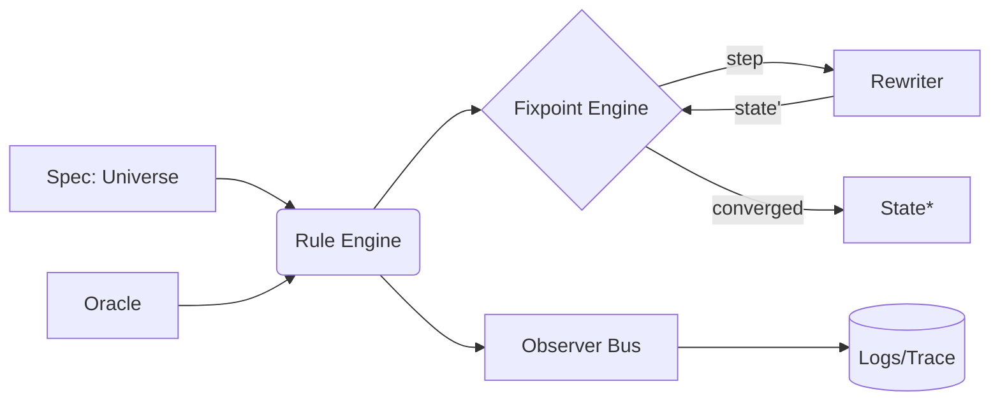

# Compute‑God

> 抽象计算之神 / the minimal meta‑computation framework for self‑reference, fixed‑points, and concept automata.

<p align="center">
  
</p>

<p align="center">
  <a href="#features">Features</a> •
  <a href="#quick-start">Quick Start</a> •
  <a href="#concepts">Concepts</a> •
  <a href="#buidl">BUIDL</a> •
  <a href="#architecture">Architecture</a> •
  <a href="#examples">Examples</a> •
  <a href="#roadmap">Roadmap</a> •
  <a href="#contributing">Contributing</a>
</p>

---

## Why Compute‑God?

> “看得更多，想得更深” 的最简实现：一个用于 **自引用**、**不动点**、**重写系统**、与 **概念自动机** 的轻量框架。它把“程序即声明”的理念落地：**声明即调用**，**定义即运行**。

* 🌱 **极简内核**：不到千行的核心（TS/py 二选一），以重写、约束与观察三件套为基元。
* ♻️ **不动点引擎**：内置 `FixpointEngine` 与 `Y` 组合子变体，支持迭代逼近与收敛准则。
* 🧬 **概念自动机**：把“概念”视为可组合的变换（Functor/Monad 风格）。
* 🧪 **可验证的规则**：规则即数据，纯文本/JSON/DSL 可审计。
* 🧩 **可嵌入**：可作为库嵌入 Next.js/服务端任务/Notebook，也可以 CLI 运行。
* 🔬 **可观测性**：事件流 + 日志 + 追踪（step/epoch/fixpoint）一体化。

> 如果你在研究「OVERDOSE 之神」「做题家之神」「全知全能神的最简实现」「木林森自同构」等元概念，Compute‑God 提供一套通用骨架。

---

## Install

**Node.js (TypeScript/JavaScript)**

```bash
pnpm add compute-god
# or
npm i compute-god
```

**Python**

```bash
pip install compute-god
```

> 两种实现保持概念等价；API 命名尽量对齐。

---

## Quick Start

> 以「不动点定义」实现“自解释求值器”：

```ts
// TypeScript
import { God, rule, fixpoint } from "compute-god";

// 1) 声明宇宙（状态 + 规则）
const U = God.universe({
  state: { term: "(Y f)" },
  rules: [
    rule("beta-reduce", ({ term }) => ({ term: beta(term) }), {
      until: ({ term }) => isValue(term) || steps() > 256,
    }),
  ],
});

// 2) 不动点求解（迭代重写直至收敛）
const result = await fixpoint(U, {
  metric: (prev, next) => editDistance(prev.term, next.term),
  epsilon: 0,            // 序列稳定（无进一步化简）即收敛
  maxEpoch: 64,
});

console.log(result.state.term);
```

```python
# Python
from compute_god import God, rule, fixpoint

U = God.universe(
    state={"term": "(Y f)"},
    rules=[
        rule("beta-reduce", lambda s: {"term": beta(s["term"])},
             until=lambda s: is_value(s["term"]) or steps() > 256)
    ]
)

result = fixpoint(U, metric=lambda a,b: edit_distance(a["term"], b["term"]), epsilon=0, max_epoch=64)
print(result.state["term"])
```

---

## Concepts

* **Universe（宇宙）**：`state + rules + observers` 的三元组。
* **Rule（规则）**：纯函数 `S -> S`，可带 `guard/until/priority` 注解。
* **Oracle（神谕）**：外部信息/启发式接口，用于不可判定或代价高的选择。
* **Observer（观察者）**：对事件流 `onStep/onEpoch/onFixpoint` 的订阅。
* **Fixpoint Engine（不动点引擎）**：在 `metric/epsilon` 下寻找 `F(x)=x`。
* **Rewriter（重写器）**：以项重写/约束传播/归约为核心的变换器。

> 数学片段：若 `F: X -> X` 在完备偏序上 **单调**，`⊥` 为最小元，则 Kleene 链 `⊥, F⊥, F²⊥, ...` 的并为 `F` 的最小不动点。Compute‑God 提供 `Monotone(F)` 辅助与 `ChainBuilder`。

---

## BUIDL

> 「BUIDL」图将 Compute‑God 的运行拆分为五个可以嵌套的宇宙，并在母宇宙中统一调度。若无法查看图像，可阅读文字版说明。

* [BUIDL 宇宙图谱（含母宇宙说明）](docs/buidl-universes.md)
* [元宇宙三元：至真、至善、至美的迭代实现](docs/metaverse-triad.md)
* [实现共同富裕：Compute-God 的应用蓝图](docs/common-prosperity.md)
* [元时空的存在性与稳定性证明](docs/meta-spacetime-proof.md)
* [「万物演示」的物理化实现指南](docs/physical-everything-demonstration.md)
* [药物实验室的设计与实现](docs/drug-lab-design-and-implementation.md)
* [BUIDL in Public 宣言与执行节奏](docs/buidl-in-public.md)
* [Heroism Universe：认清真相后依然热爱生活](docs/heroism-universe.md)

---

## Architecture



**核心包结构**

```
./packages/
  core/            # 内核：Universe/Rule/Observer/Fixpoint
  rewriters/       # 词法/一阶/λ-演算/约束传播/AST 规则
  dsl/             # 声明式 DSL 与校验
  std/             # 常用“神”：Overdose、Solver、Teacher、Mirror
  adapters/        # CLI / Node / Py / WebWorker / Next.js RSC
```

---

## Examples

### 1) OVERDOSE 之神（过载逼近）

> 用强制超参放大（温度/扩散/并行度）探索“过量信息→结构显现”的临界点。

```ts
const Overdose = God.universe({
  state: { seed: 42, pool: [] as string[] },
  rules: [
    rule("expand", s => ({ pool: s.pool.concat(mutate(s.seed)) })),
    rule("select", s => ({ pool: topk(s.pool, 8) }), { priority: 2 }),
  ],
  observers: [God.log.step()],
});

// 在 KL-散度阈值下寻找稳态“主题集”
const S = await God.run.untilFixpoint(Overdose, {
  metric: diversityKLD, epsilon: 1e-3, maxEpoch: 128
});
```

### 2) 做题家之神（Teacher/Solver 双态）

```python
from compute_god import Universe, rule, role

Teacher = role("Teacher")
Solver  = role("Solver")

U = Universe(state={"queue": [], "solutions": []}, rules=[
  rule("ask",   lambda s: {"queue": enqueue(s["queue"], gen_problem())}, role=Teacher),
  rule("solve", lambda s: {"solutions": s["solutions"] + [solve(head(s["queue"]))]}, role=Solver,
       guard=lambda s: len(s["queue"])>0),
])
```

### 3) Mirror 神（自解释）

> 程序的解释器由程序本身声明：`eval(spec, program) -> trace`。

```ts
const Mirror = God.universe({ state: { prog, trace: [] }, rules: [
  rule("step", s => exec(spec, s.prog, s.trace), { until: s => halted(s.prog) })
] })
```

---

## DSL（声明即运行）

```toml
[universe]
name = "Compute-God"

[state]
term = "(Y f)"

[[rules]]
name = "beta-reduce"
impl = "std.lambda.beta"
until = "std.lambda.isValue || steps()>256"
priority = 1

[fixpoint]
metric  = "std.metric.editDistance(term)"
epsilon = 0
maxEpoch = 64
```

运行：

```bash
compute-god run spec.toml
```

---

## API Sketch

```ts
type State = Record<string, unknown>

interface Rule {
  name: string
  apply: (s: State, ctx: Ctx) => State | Promise<State>
  guard?: (s: State, ctx: Ctx) => boolean
  until?: (s: State, ctx: Ctx) => boolean
  priority?: number
  role?: string
}

interface Universe { state: State; rules: Rule[]; observers?: Observer[] }

declare function fixpoint(U: Universe, opts: { metric: (a:State,b:State)=>number; epsilon:number; maxEpoch:number }): Promise<Universe>
```

---

## Mathematics

* **不动点**：`x* = F(x*)`。Kleene 定理确保在 CPO + 单调下最小不动点存在。
* **Y 组合子**：`Y = λf.(λx.f (x x)) (λx.f (x x))`，在惰性/名义求值下用于递归。
* **度量选择**：编辑距离 / KL 散度 / 变分界 / 自定义拟合误差。

> Compute‑God 内置 `Monotone(F)`, `Contractive(F, L<1)`, `BanachFix`（压缩映射）。

---

## Observability

* 事件：`step`, `epoch`, `fixpoint:converged|diverged|maxed`。
* 追踪：结构化日志（JSONL）、火焰图（可选）、可视化（Web UI）。
* Repro：固定随机源、规则版本指纹、spec 哈希。

---

## CLI

```bash
compute-god init         # 生成骨架工程
compute-god run spec.toml  --trace
compute-god dev          # 热重载 DSL 规则
compute-god viz trace.jsonl
```

---

## Project Layout

```
Compute-God/
 ├─ packages/
 │   ├─ core/
 │   ├─ dsl/
 │   ├─ rewriters/
 │   └─ std/
 ├─ examples/
 │   ├─ overdose/
 │   ├─ teacher-solver/
 │   └─ mirror/
 ├─ apps/
 │   ├─ cli/
 │   └─ web-viz/
 └─ README.md
```

---

## Roadmap

* [ ] `std.lambda.*`：λ-演算/类型化核心
* [ ] `std.logic.*`：一阶逻辑与约束传播
* [ ] `std.game.*`：有限/无限游戏算子（价值流/熵流）
* [ ] `std.meta.mirror`：自解释求值器与证明追踪
* [ ] `adapters.next`：RSC + Server Actions 嵌入
* [ ] `viz`：时间线/不动点收敛曲线/规则竞争热度图

---

## Contributing

欢迎以 PR/Issue 的形式贡献规则、度量、可视化与新“神”。

1. Fork 本仓库并创建分支：`feat/<your-feature>`
2. `pnpm i && pnpm -w build && pnpm -w test`
3. 提交前运行 `pnpm -w lint:fix`

> 我们遵循 [Conventional Commits](https://www.conventionalcommits.org/) 与 MIT 许可证。

---

## License

MIT © Compute‑God Contributors

---

## FAQ

**Q: 这是 AI 框架吗？**
A: 更像“计算论实验室”。它既可包裹模型/启发式（作为 Oracle），也可用纯规则/重写做形式化实验。

**Q: 与普通规则引擎的区别？**
A: 我们以“寻找不动点”为运行准则，把“规则竞争”与“收敛判据”提到一等公民。

**Q: 会不会过度抽象？**
A: 通过 `std/*` 提供可运行的具体模板（Overdose、Teacher/Solver、Mirror），先跑起来再抽象。
