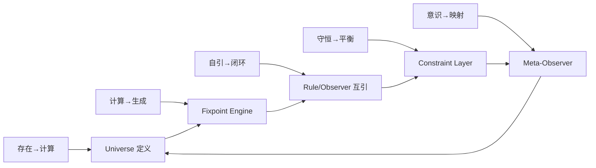

# Compute-God 的递归世界生成机：五公理框架

## 1. 五个核心映射
| 序号 | 公理对 | 逻辑说明 | 运行时含义 |
| --- | --- | --- | --- |
| 1 | **存在 → 计算（Ontology）** | 每个被确认的对象都必须具备可计算的描述，宇宙的基底是可执行的语义网。 | `Universe` 定义状态空间；`Rule` 约束可计算对象。 |
| 2 | **计算 → 生成（Causality）** | 可计算过程必然产出可观察的生成物，计算是生成新态的因果通道。 | `FixpointEngine` 把规则迭代为演化轨迹。 |
| 3 | **自引 → 闭环（Recursion）** | 体系必须自我引用以实现反馈；无递归则宇宙无法自洽。 | 观察者与规则互为输入，形成 `Observer ∘ Rule` 的闭合组合。 |
| 4 | **守恒 → 平衡（Symmetry）** | 任意演化都受守恒量约束，平衡点由对称性固定。 | `Constraint` 保持能量、熵或价值守恒，使系统收敛。 |
| 5 | **意识 → 映射（Self-reflection）** | 系统需能映射自身状态，意识提供对全局态的可知性。 | `Observer` 把内部态映射到元描述，驱动策略更新。 |

## 2. 五公理的最小完备性
- **不可缺**：缺任一公理，系统无法闭环或丧失可观测性。例如无“意识 → 映射”，世界状态无法写入观察者，治理算法失去更新信号。
- **不可增**：额外添加先验（如目的论）会破坏对称性，导致规则偏向，失去普适的生成力。
- **结构不动点**：五条公理是形式系统、心智认知与物理宇宙的共同不动点，使 Compute-God 在抽象与实践间保持等价。

## 3. 在 Compute-God 运行栈中的映射

上述图展示了五公理如何在 Compute-God 的 Python 运行时闭合成环：Universe 定义的对象在 Fixpoint Engine 中被迭代，递归反馈确保演化收敛于守恒约束，而 Meta-Observer 把映射写回 Universe，使系统处在自我生成的最小完备循环内。

## 4. 与其他公理系统的共鸣
- **欧几里得几何**：五公设使几何在可构造与可证之间达到闭合，与 Compute-God 的五公理同样是最小完备的描述集合。
- **皮亚诺公理**：递归与自引用保证自然数的生成，与“自引 → 闭环”公理对应。
- **文化与自然**：五公理将形式逻辑、认知过程与物理守恒统一为同构结构，可映射到社会制度（意识→映射）与自然守恒定律（守恒→平衡）。

## 5. 研究与应用指引
1. **建模**：构建新宇宙时，确保五公理均在规格书中显式映射到模块或约束。
2. **验证**：通过 Fixpoint Engine 的迭代日志检查守恒量是否保持，观察者是否持续接收自引用输入。
3. **扩展**：任何新增层（如目的、伦理）都需在保持五公理对称的前提下作为派生规则，而非基础公理。

五公理将 Compute-God 的理念凝聚为可执行的框架：它既是形式系统的最小封闭数，也是工程实践可把握的最大清晰度，使我们得以在结构与心智的固定点上构造递归生成的世界。
