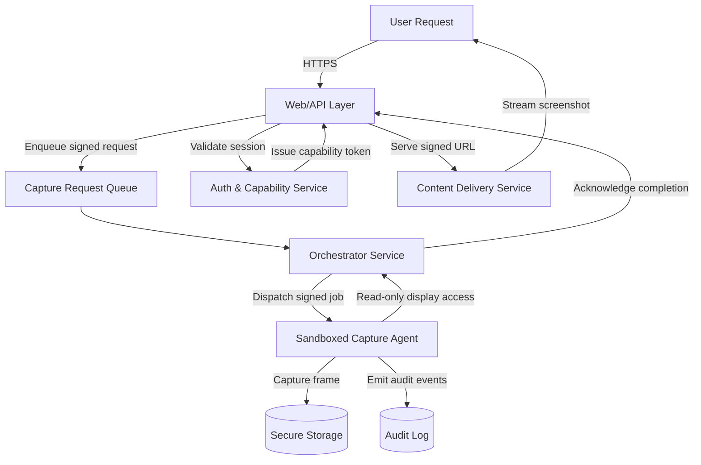

# System Screenshot Functionality Architecture

The following diagram illustrates a modular approach to provide on-demand system screenshots from a remote assistant environment. It emphasizes isolation between user-facing surfaces and privileged capture capabilities.

## Component Overview

- **User Request (U):** Entry point from the assistant or dashboard requesting a screenshot.
- **Web/API Layer (WA):** Normalizes requests, handles authentication handshakes, and enqueues capture jobs.
- **Auth & Capability Service (AC):** Issues short-lived capability tokens restricting screenshot scope and lifetime.
- **Capture Request Queue (Q):** Buffers requests to decouple bursty demand from capture throughput.
- **Orchestrator Service (OS):** Polls the queue, resolves capability tokens, and manages the lifecycle of capture agents.
- **Sandboxed Capture Agent (SG):** Runs with the minimum privileges required to access the display server and produce screenshots. It streams pixels only to secure storage.
- **Secure Storage (SS):** Holds encrypted artifacts until they are retrieved by the requesting party or expire.
- **Content Delivery Service (CD):** Provides signed URLs or streaming endpoints to deliver the screenshot artifact.
- **Audit Log (L):** Receives immutable events for observability and compliance.

## Sequence Summary

1. The user initiates a screenshot request via the assistant, which reaches the Web/API layer.
2. The API authenticates the session and requests a scoped capability token from the Auth & Capability Service.
3. The signed request is placed onto the Capture Request Queue.
4. The Orchestrator Service picks up the job, validates the capability token, and dispatches it to an available Sandboxed Capture Agent.
5. The Capture Agent connects to the display server in read-only mode, captures the frame, and pushes the artifact into Secure Storage while emitting audit events.
6. Upon successful capture, the Orchestrator notifies the Web/API layer, which returns a signed delivery URL.
7. The user downloads the screenshot via the Content Delivery Service. Audit logs record the entire process.

## Security Considerations

- Capability tokens bind requests to a specific user, scope, and timeout to prevent misuse.
- Capture agents operate within locked-down sandboxes with no outbound network access except to Secure Storage and the Orchestrator.
- All artifacts are encrypted at rest and deleted after a configurable retention period.
- Audit logs are append-only to support forensic analysis.

## Extensibility Notes

- Additional capture modalities (video clips, logs) can reuse the same queue/orchestrator pattern with specialized agents.
- The queue and orchestrator can scale horizontally, while capture agents can be provisioned dynamically on container platforms.
- The Web/API layer can expose both synchronous (webhook callback) and asynchronous (polling) retrieval flows depending on client capability.
